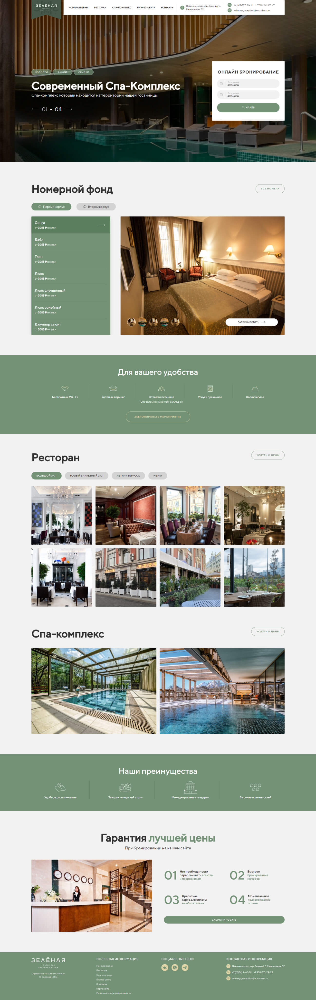
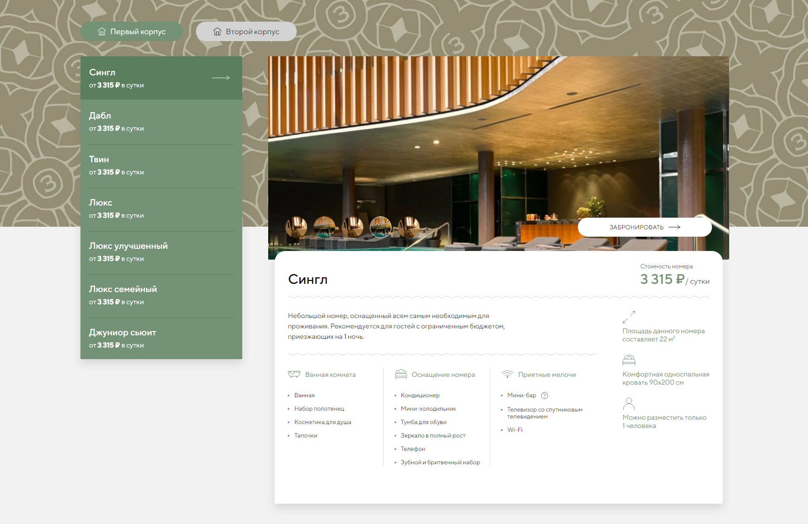
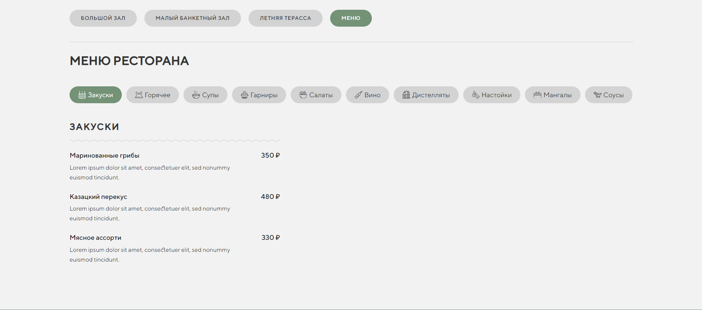

## О проекте

Верстка многостраничного сайта и настройка JavaScript функционала для компании "Зелёная гостиница-ресторан и СПА"

**Реализованный функционал:**
* Анимации
* Слайдеры
* Табы 
* Модальные окна
* Zoom фотографий по клику

## Запуск приложения

> Откройте сайт по ссылке: https://aleksandrkuzmin-dev.github.io/green-hotel/

## Скриншот главной страницы:

## Скриншот выбора номера:

## Скриншот меню ресторана:

